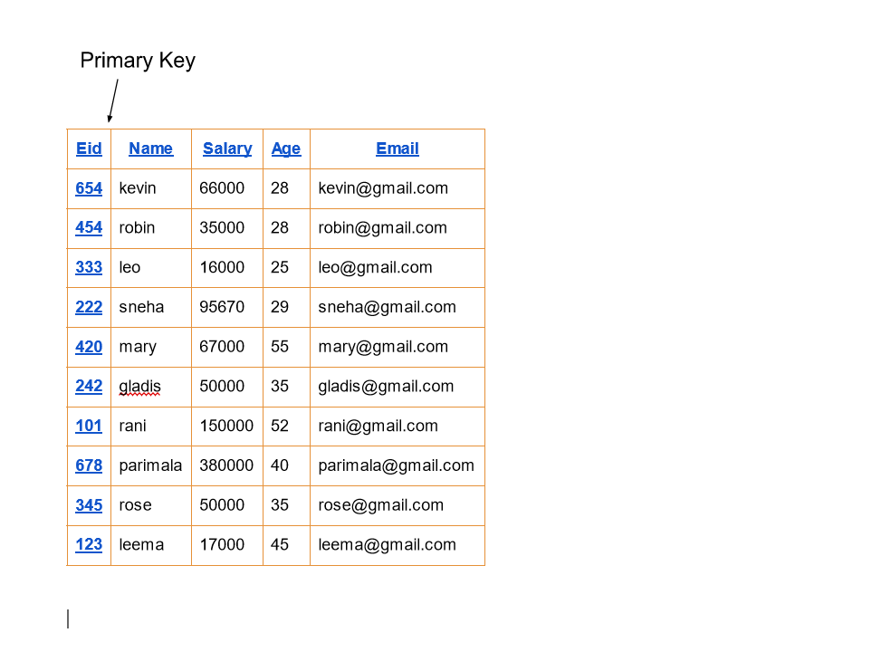

# Django ORM Web Application

## AIM
To develop a Django application to store and retrieve data from a database using Object Relational Mapping(ORM).

## Entity Relationship Diagram


## DESIGN STEPS

### STEP 1:
Create a migration file that contains code for the database schema of a model in myapp

### STEP 2:
Run Django admin

### STEP 3:
Run Django admin

## PROGRAM
```
mdoela.py

from django.db import models
from django.contrib import admin 
class Employee(models.Model):
   eid=models.CharField(max_length=20,help_text="Employee ID")
   name=models.CharField(max_length=20)
   salary=models.IntegerField()
   age=models.IntegerField()
   email=models.EmailField()
class EmployeeAdmin(admin.ModelAdmin):
    list_display=("eid","name","salary","age","email")

admin.py

from django.contrib import admin
from.models import Employee,EmployeeAdmin
admin.site.register(Employee,EmployeeAdmin)
```
## OUTPUT


## RESULT
The program executed successfully